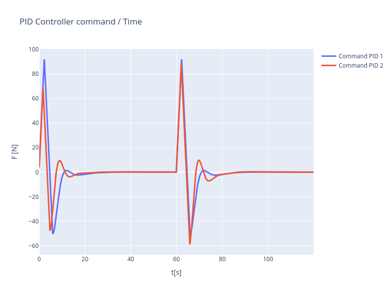
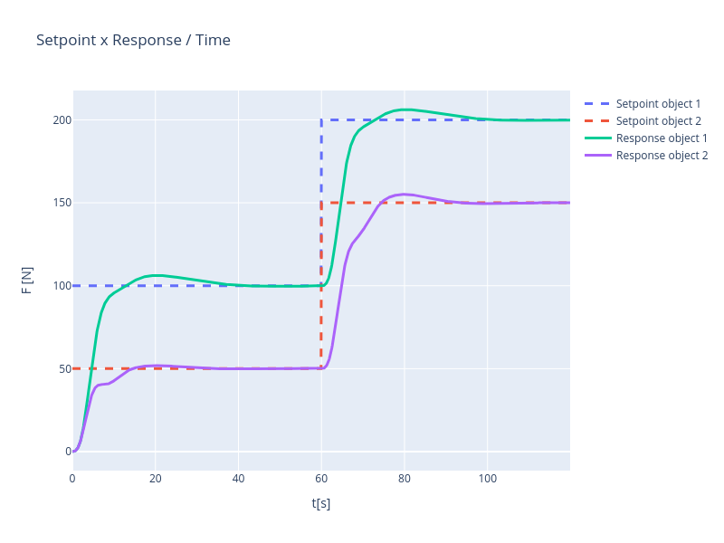

# PID in F#

A translation from [simorxb/PID-C-Struct](https://github.com/simorxb/PID-C-Struct) from C to F#.

* Notice that the txt result is different from `simorxb`'s since in his implementation, due to C specificities, the program loses precision after time `2.700000`. You can find more information regarding this C problem here: [link](https://github.com/MicrosoftDocs/cpp-docs/blob/main/docs/build/why-floating-point-numbers-may-lose-precision.md).

## Simulation results

